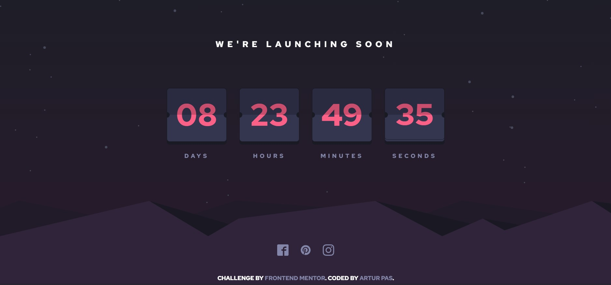

# Frontend Mentor - Launch countdown timer solution

This is a solution to the [Launch countdown timer challenge on Frontend Mentor](https://www.frontendmentor.io/challenges/launch-countdown-timer-N0XkGfyz-). Frontend Mentor challenges help you improve your coding skills by building realistic projects. 

## Table of contents

- [Overview](#overview)
  - [The challenge](#the-challenge)
  - [Screenshot](#screenshot)
  - [Links](#links)
  - [Built with](#built-with)
- [Author](#author)

## Overview

### The challenge

Users should be able to:

- See hover states for all interactive elements on the page
- See a live countdown timer that ticks down every second (start the count at 14 days)
- **Bonus**: When a number changes, make the card flip from the middle

### Screenshot

### Links

- Solution URL: [https://github.com/Pasek108/LaunchCountdownTimer/](https://github.com/Pasek108/LaunchCountdownTimer/)
- Live Site URL: [https://pasek108.github.io/LaunchCountdownTimer/](https://pasek108.github.io/LaunchCountdownTimer/)

### Built with

- HTML 5
- CSS 3
- tailwindcss
- JS (ES 2017)

## Author

- Website - [Artur Pas](https://pas-artur.000webhostapp.com)
- Frontend Mentor - [@Pasek108](https://www.frontendmentor.io/profile/Pasek108)